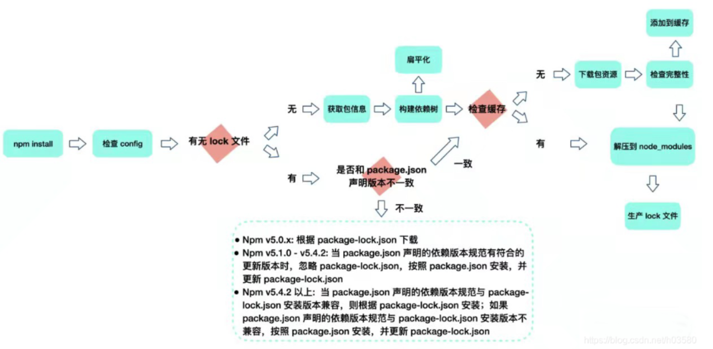

# Node
## 1. 运行 npm install 后会发生什么？

### 一 检查获取 npm 配置文件
获取配置优先级为 
> 项目级别的.npmrc文件 > 用户级别的.npmrc文件 > 全局的.npmrc文件 > npm内置的.npmrc文件

npm 根据这些配置文件来决定如何进行安装，例如代理服务器、镜像源等设置。
### 二 检查是否存在 package-lock.json 文件
- **存在package-lock.json** 
&nbsp; &nbsp; 如果存在package-lock.json文件，检查package-lock.json和package.json中声明的依赖是否一致

> &nbsp;&nbsp; &nbsp;  **一致** 直接使用package-lock.json文件中依赖，从缓存或者网络中加载依赖

> &nbsp; &nbsp; &nbsp; **不一致** 如果两个文件中的依赖不一致，不同npm版本处理方式不同

- **不存在package-lock.json** 
&nbsp; &nbsp; 如果不存在，会解析package.json中的依赖递归构建依赖树，进行扁平化
### 三 缓存判断
依赖解析后会进行缓存判断，判断是否有相关依赖的缓存
- **存在缓存**
将缓存的资源解压到node_modules中
- **不存在缓存**
根据刚才解析的依赖中下载资源包，并校验完整性，并添加到缓存，同时解压到node_modules中
### 四 更新package-lock.json文件
- npm会生成或更新 package-lock.json 文件，以确保未来安装时能够得到相同版本的依赖。
- 这有助于项目在不同环境和不同开发者之间保持依赖的一致性。

## 2. node常见的包管理工具有哪些？它们有什么区别？
常见的有：<strong>npm cnpm npx pnpm yarn nvm nrm</strong>
- **npm**
> npm 是 Node.js 的默认包管理器，用于安装、发布和管理 JavaScript 包
- cnpm
> cnpm 是淘宝团队提供的 npm 镜像，使用命令是和npm类似，但使用的是淘宝的镜像源，用于加速 npm 安装包的速度。
- npx
> npx 是 npm 5.2.0 版本引入的一个工具，用于在不全局安装包的情况下运行本地安装的包。通过 npx，开发者可以直接运行项目依赖项中的命令，而不需要全局安装这些包。
- yarn
> yarn 是由 Facebook 开发的另一个包管理工具，主要解决了早期npm的一些问题比如：不支持离线模式、树形结构的依赖、依赖安装不确定性等。
- pnpm
> pnpm类似npm yarn，它与 npm 和 Yarn 的主要区别在于它使用硬链接和符号链接来共享依赖项，从而节省磁盘空间。
- nvm
> nvm 是 node 版本管理工具
- nrm 
> nrm 是 node 下载镜像源管理工具