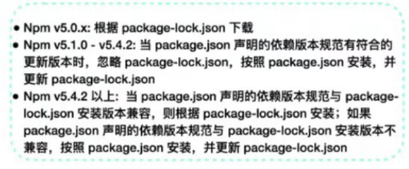

# Node

## 运行 npm install 后会发生什么？

### 1. 检查获取 npm 配置文件

优先级为 项目级别的.npmrc文件 > 用户级别的.npmrc文件 > 全局的.npmrc文件 > npm内置的.npmrc文件 npm 根据这些配置文件来决定如何进行安装，例如代理服务器、镜像源等设置。

### 2. 检查是否存在 package-lock.json 文件

#### 存在package-lock.json

如果存在package-lock.json文件，检查package-lock.json和package.json中声明的依赖是否一致

##### 一致

直接使用package-lock.json文件中依赖，从缓存或者网络中加载依赖

##### 不一致
如果两个文件中的依赖不一致，不同npm版本处理方式不同

#### 不存在package-lock.json

如果不存在，会解析package.json中的依赖递归构建依赖树，进行扁平化

### 3. 缓存判断

依赖解析后会进行缓存判断，判断是否有相关依赖的缓存

##### 存在缓存

将缓存的资源解压到node_modules中

##### 不存在缓存

根据刚才解析的依赖中下载资源包，并校验完整性，并添加到缓存，同时解压到node_modules中

### 4. 更新package-lock.json文件

- npm会生成或更新 package-lock.json 文件，以确保未来安装时能够得到相同版本的依赖。
- 这有助于项目在不同环境和不同开发者之间保持依赖的一致性。
  