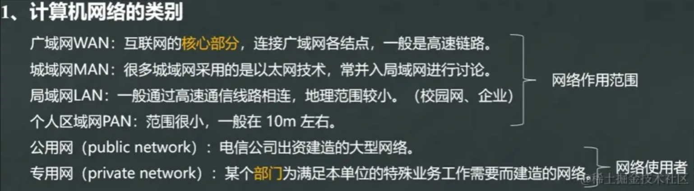
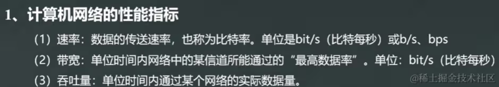
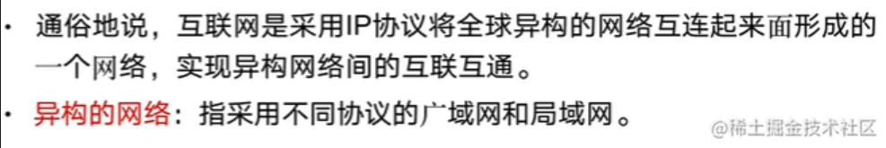
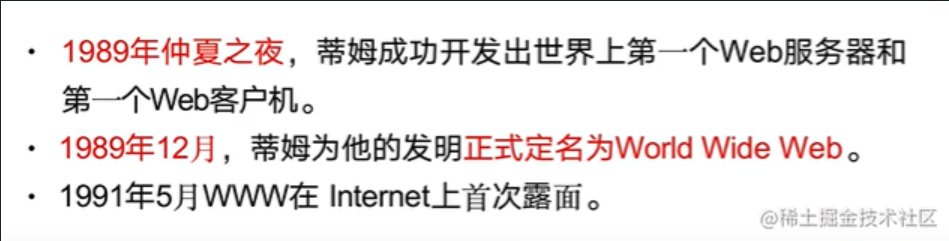
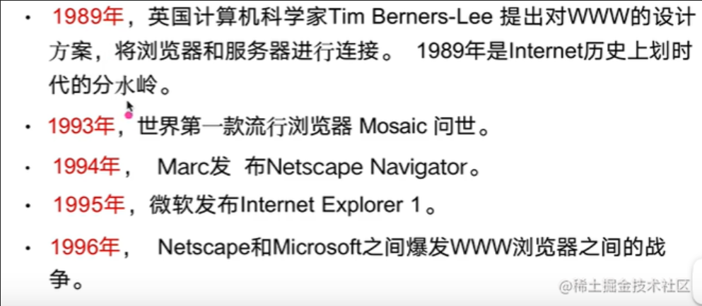

# 网络基础

**网络的特点**：连线和节点 

 

## 广域网

主机与主机之间数据交换：CCP(通信控制处理机)

## 互联网和互连网

**互联网(Internet)** 采用IP协议栈，指的是世界上目前最大的互"连"网络 

**互连网(internet)** 由路由器将网络连接起来，组成一个功能单一的大规模的“虚拟网络”

**网络的作用**：连通和共享

## WWW

WWW是World Wide Web的简称

## TCP/IP 四层体系结构

TCP/IP（Transmission Control Protocol/Internet Protocol）协议是一个基于分层体系结构的网络协议套件，它包含四个主要的层次，从低到高分别是：

1. **链路层（Link Layer）：** 这一层处理物理介质和数据链路的细节，包括硬件设备、驱动程序、网络接口卡（NIC）等。它主要负责将数据帧从一个节点传输到相邻节点。
1. **网络层（Internet Layer）：** 网络层负责在不同的网络之间路由数据，以及为数据包选择合适的路径。在TCP/IP中，最常见的网络层协议是Internet Protocol（IP）。
1. **传输层（Transport Layer）：** 这一层的主要任务是提供端到端的通信服务，确保数据的可靠传输。TCP（Transmission Control Protocol）和UDP（User Datagram Protocol）是在传输层操作的两个主要协议。
1. **应用层（Application Layer）：** 应用层是最高层，提供网络服务和应用程序之间的接口。各种应用程序，如Web浏览器、电子邮件客户端和文件传输协议（FTP）等，都在应用层操作。

## TCP/UDP协议特点

### UDP

- 不需要先建立连接，提供无连接服务
- 不提供可靠交付
- 收到UDP报文后，无需任何确认

### TCP

- 提供面向连接服务
- 不提供广播或多播服务
- 收到TCP报文后，需要确认
- 协议复杂，开销大，占用较多处理机资源
